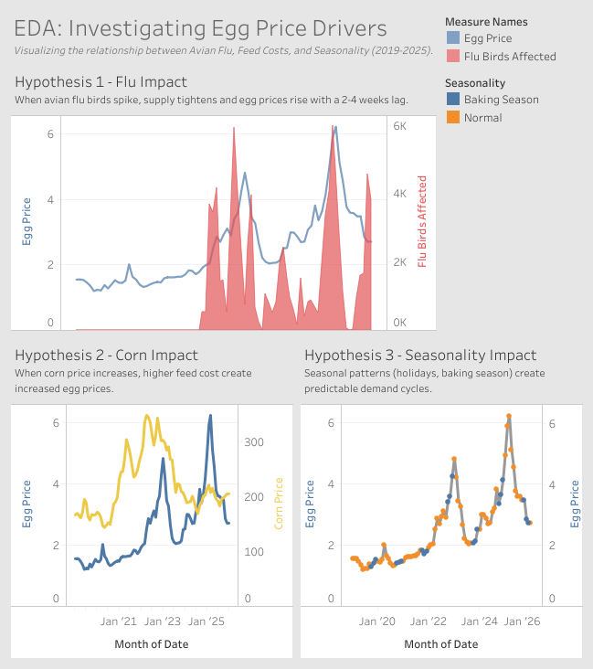
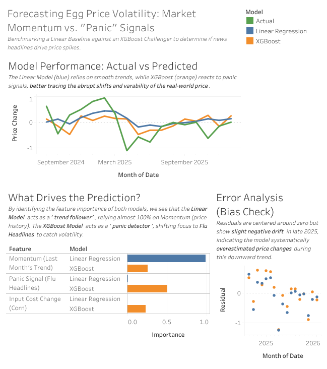

# Egg Price Volatility Prediction

Predict monthly egg price ($/dozen) using corn futures, avian flue signals, and seasonality to inform sell vs hold decisions for inventory strategists.

## Business Overview

Eggs are perishable and cold-storage capacity is expensive. When prices move unexpectedly, Inventory Strategists face operational risk: holding inventory too long,
paying for storage they don't need, or selling too early and missing margin opportunities. A reliable one-month price outlook reduces this uncertainty and supports smarter operational planning. 

- **Stakeholder and decision:** Inventory Strategist - determining when to sell vs hold 

- **Business Impact:**
    - Reduce operational risk from mistimed storage decisions
    - Improve planning for storage capacity and logistics
    - Protect margins by anticipating price movements
    - Enhance contract negotiation timing with buyers and suppliers

- **Decision Horizon:** Strategists typically plan inventory movements 2-6 weeks ahead, making a one-month forecast operationally meaningful.

- **Project Goal:** Translate public market signals into a forward-looking price estimate that reduces operational uncertainty.

- **Scope Boundary:**
    - MVP: price-only model using public signals
    - Future Work: Integrate additional operational signals (e.g., weekly inventory counts, fuel prices, weather impacts) using USDA and other public data APIs. 
    
- **Status:** Outline complete; next step: data ingestion and baseline model

## Predictive Objective

- **Target Variable:** Montlhy U.S. egg price ($/dozen)
    - Captures the intersection of supply, demand, disease shocks, feed costs, and market sentiment
    - Represents the actual outcome the strategist care about (revenue per unit)
    - Avoids the trap of predicitng only supply or demand, which would miss half the system

- **Feature Strategy (Leading Factors):**
    - **Core Features (MVP):**
        - Avian flue cases (supply shocks)
        - Corn futures (feed costs)
        - Seasonality (monthly patterns)
    - **Secondary Features (Future Exploration):** 
        - Fuel prices (transportation cost)
        - Weather patterns (flock health, heat stress)
        - Weekly inventory counts (operational constraints)

- **Joining Logic and Preprocessing:**
    - Traget variable is monthly, so all features are aggregated to monthly
    - Lags are created so the model can learn from prior periods 
    - Daily or weekly data is bucketed into monthly averages or sums
    - Zero-filling is used for flue data before 2022 (no outbreaks ≠ missing data)
    - All tables are joined on data after aggregation
    - No imputation of unknown values - avoid injecting artifical signals

## Hypothesis Story
**Hypothesis 1:** When avian flu birds spike, supply tightens and egg prices rise with a lag of ~2-4 weeks
**Hypothesis 2:** When corn futures increases, producers face higher feed costs and prices rise to protect margins
**Hypothesis 3:** Seasonal patterns (holidays, baking seasons) create predictable demand cycles

## ETL Pipeline:
- **Extract:**
    - **FRED API:** Egg CPI, corn futures
    - **USDA HPAI:** Avian flu outbreaks, release dates, birds affected
    - Robust parsing for messy USDA structure (500+ dynamic columns)

- **Transform:**
    - Standarize all sources to monthly frequency
    - Aggregate flu data into:
        - `flu_outbreak_count` (monthly mean)
        - `flu_birds_affected` (monthly mean)
    - Forward/backward fill for economic series
    - Zero-fill for flu data to avoid false signals
    - Outer-join to preserve all months
    - Add month and quarter columns to count for Seasonality
    
- **Load:**
    - Load final dataset into PostgreSQL via SQLAlchemy
    - Dockerized Postgres environment
    - Automatic table creation and date indexing ingestion

## Exploratory Data Analysis 
[Click here to explore the interactive EDA Dashboard](https://public.tableau.com/views/EDAEggPriceForecasting/Dashboard1?:language=en-US&:sid=&:redirect=auth&:display_count=n&:origin=viz_share_link)

- **Hypothesis Findings**
    - **Hypothesis 1 (Strong Support): Avian Flu Supply Shocks** 
        - Outbreak spikes consistently precede egg price increases by **1–2 months**.
        - Price impact scales with **birds affected**, confirming strong supply‑side sensitivity.
    - **Hypothesis 2 (Partial Support): Feed Costs (Corn)**
        - **2019-2023:** Corn and egg prices moved together, suggesting feed costs mattered in stable periods.
        - **2024-Present Divergence:** Corn stabilized while egg prices surged, indicating **feed costs are no longer the main driver.** 
    - **Hypothesis 3 (Weak Signal): Seasonal Demand**
        - “Baking season” months do not reliably align with price peaks
        - **Finding:** Largest spikes often occur in **non‑seasonal months**, suggesting demand seasonality is not a dominant factor.

- **Correlation Analysis (Revised After Differencing)**
    - **Raw Price Correlations Were Misleading**
        - Egg price and its 1-month lag showed an extremely high correlation (**0.96**).
        - This created the illusion that most features were strongly predictive simply because prices trend smoothly over time.
        - **Insight:** Raw-price correlations overstated relationships and masked true drivers of volatility.
    - **Differenced Target Reveals True Predictive Signals**
        - After switching to Δ price (month-over-month change):
            - **Outbreak count (News)** became a **strong** predictor than **Birds Affected (Biomass)**.
            - Corn price changes show only a weak relationship (~0.12).
            - Month and Quarter remain low-value features.
    - **Multicollinearity**
        - Flu outbreak count and birds affected are highly correlated.
        - **Modeling Implication:** Remove `flu_birds_affected` to avoid redundant signals and focus on the stronger "Market Panic" signal from `flu_outbreak_count`.
    - **Modeling Implications**
        - **Stationary:** Differencing the target avoids a "lazy model" that achieves high accuracy by simply copying last month's price.
        - **Drivers:** Lagged outbreak frequency becomes the primary external driver, while momentum (`price_diff_lag`) drives the baseline.
        - Feed-cost signals are present but secondary to biological shocks.
        - Seasonality shows little to no signal.

## Model Implementation 

- **Validation Strategy (Time-Series Split)**
    - **No Random Shuffling:** To prevent data leakage (using future data to predict the past), the dataset was split chronologically.
    - **Training Set:** 2019 – mid-2024 (80% of data).
    - **Test Set:** mid-2024 – 2026 (20% of data).
    - **Stationarity:** Target variable was transformed to **Price Change ($/month)** to remove trends and ensure statistical validity.

- **Baseline vs Challenger Model**
    - **The Baseline:** Linear Regression
        - With only ~85 observations, a simple model reduces the risk of overfitting.
        - Linear regression on lagged features provides a clean benchmark: *"Can the market be explained with straightforward linear relationships?*
        - This baseline helps determine whether more complex models are truly necessary.
    
    - **The Challenger:** XGBoost (Gradient Boosting)
        - Market reactions to shocks (e.g., avian flue headlines) are often **non-linear**. 
        - XGBoost can capture threshold effects, interactions, and non-linear patterns that linear regression cannot.
        - This model tests whether the market's behavior contains complexity beyond simple trends.

## Results and Outcomes

[Click here to explore the interactive Forecast Dashboard](https://public.tableau.com/views/EggPriceDynamicsFromEDAtoForecasting/AnalysisDash?:language=en-US&:sid=&:redirect=auth&:display_count=n&:origin=viz_share_link)

### 1. Performance Verdict: Simplicity Wins
The Linear Regression baseline outperformed the complex XGBoost model, proving that in a small-data environment, robust linear trends outweigh complex non-linear patterns.

| Model | MAE (USD) | Interpretation |
|-------|-----------|----------------|
| **Linear Regression** | **0.38** | On average, predictions miss by 38 cents. |
| **XGBoost** | 0.43 | On average, predictions miss by 43 cents. |

### 2. What Drives the Price? (Feature Importance)
The two models revealed a split in market behavior:
* **Momentum dominates (Linear Model):** The Linear model relied almost 100% on `price_momentum` (last month's trend). This suggests the egg market is highly "sticky"—prices tend to continue their current trajectory.
* **News drives volatility (XGBoost):** The XGBoost model prioritized `flu_outbreak_count` (News Headlines) over biological supply data. This confirms the hypothesis that **market panic** (news cycles) drives volatility.

### 3. Business Impact for the Inventory Strategist
* **Base Case:** Use the Linear Model for standard monthly planning (expected error margin: $\pm$ $0.38).
* **Risk Case:** Monitor the XGBoost "Panic Signal." If XGBoost predicts a sharp deviation from the Linear forecast, it indicates a **high-volatility event** driven by news sentiment, signaling a need to lock in prices early or hold inventory.
* **Supply Chain Stability:** The strong momentum signal implies egg prices rarely swing without warning, enabling more confident forward‑buying strategies.
* **Crisis Detection:** Flu‑related news spikes act as an early‑warning system for sudden price jumps, giving strategists a lead time advantage.
* **Scenario Planning:** The dual‑model approach (steady‑state vs. volatility‑state) supports more resilient procurement strategies under both normal and stressed market conditions.
* **Cost Optimization:** By identifying when volatility is not biologically driven, strategists can avoid overreacting to short‑term noise and reduce unnecessary hedging costs.

## What I Learned

Working through this project taught me more than just forecasting. I built a debugging workflow using Python’s logging system, learned to pull and manage data from REST APIs, and dealt with the realities of messy, inconsistent datasets. Handling missing values forced me to understand how different imputation strategies affect time‑series integrity, especially the risks of backward fill and the importance of preserving causality with forward fill and lag features. I also deepened my understanding of temporal structure by transforming raw variables into stationary forms and engineering features that reflect real market behavior. On the visualization side, I became comfortable with Tableau’s dual‑axis charts, custom tick intervals, and layered mark types, which helped me communicate insights clearly and avoid misleading stakeholders. Altogether, these skills strengthened my ability to translate noisy real‑world data into forecasts that support practical, business‑driven decisions — especially for inventory planning under both stable and high‑volatility conditions.

## Next Steps/Future Work

There are several opportunities to extend this forecasting pipeline and deepen its ability to detect early warning signals in the egg market:

- **Expand flu‑related features:** Incorporate active vs. inactive outbreak flags, outbreak durations, and severity progression to distinguish short‑term news spikes from sustained biological disruptions.

- **Integrate USDA API data:** Pull supply, demand, and inventory indicators from USDA Market News and WASDE reports to ground the model in real production fundamentals.

- **Develop a regime‑switching framework:** Formalize the “stable vs. volatile” market behavior observed in the results using Markov switching models or volatility classifiers.

- **Incorporate broader environmental data sources:** Explore additional external drivers such as fuel prices, transportation costs, extreme weather events, and regional climate aonomalies.